# Interpong

Balls bouncing around a multi-verse

Adapted from: https://github.com/ipenywis/react-socketio-tic-tac-toe


## Setup

### Environment
| Key | location | Description |
| - | - | - |
| `REACT_APP_SOCKET_SERVER_URL` | client | The url, with port, to the backend socket server, used by the front end. |
| `PORT` | server | The incoming port for the backend server. |

#### Local Development
`.env` file, server (./)
```
PORT=3000;
```

`.env` file, client (./client/)
```
REACT_APP_SOCKET_SERVER_URL="http://localhost:3000";
```


# Sequence Diagram

```mermaid
sequenceDiagram
    participant P1 as Player1
    participant C1 as Client1
    participant S as Server
    participant C2 as Client2
    participant P2 as Player2

    note over P1, P2: System Initializes
    S->>S: Start listening
    P1->>C1: Requests client application
    C1->>C1: Starts
    
    note over P1, P2: Client Connects
    C1->>P1: Show View:<br>Waiting for Connection
    C1->>S: Create a connected socket<br>event: connect/connection
    S->>S: Respond to connect<br>socket.on("connect/connection")
    S->>C1: ACK connect<br>message TBD
    C1->>P1: Show View:<br>Game Room Selection

    note over P1, P2: Game Start
    P1->>C1: Submits a game room name
    C1->>P1: Show View:<br>Joining Room
    C1->>S: Join game room by name<br>Event: room_join<br>data: gameroom_name
    S->>S: Respond to room join<br>socket.on("room_join")
    S->>S: Verify Game Room isn't at max connected sockets
    S->>S: Join Game Room
    S->>C1: Send event Joined Room:<br>event: room_joined
    C1->>C1: Respond to room_joined<br>socket.on("room_joined")
    C1->>P1: Show View:<br>Waiting for Other Players
    S->>S: Check if max connected sockets are connected
    P2->>C2: Submits a game room name
    C2->>P2: Show View:<br>Joining Room
    C2->>S: Join game room by name<br>Event: room_join<br>data: gameroom_name
    S->>S: Respond to room join<br>socket.on("room_join")
    S->>S: Verify Game Room isn't at max connected sockets
    S->>S: Join Game Room
    S->>C2: Send event Joined Room:<br>event: room_joined
    C2->>C2: Respond to room_joined<br>socket.on("room_joined")
    S->>S: Check if max connected sockets are connected
    S->>C1: Send Room Ready event<br>event: room_ready
    C1->>C1: Respond to room ready<br>socket.on("room_ready")
    C1->>P1: Show View:<br>Game Start in X Seconds
    S->>C2: Send Room Ready event<br>event: room_ready
    C2->>C2: Respond to room ready<br>socket.on("room_ready")
    C2->>P2: Show View:<br>Game Start in X Seconds
    C1->>S: ACK
    C2->>S: ACK
    S->>C1: Event Game Start to Player 1<br>event: game_start
    S->>C2: Event Game Start to Player 2<br>event: game_start
    C1->>C1: Respond to game_start<br>socket.on("game_start")
    C1->>C1: Make gameboard interactable as Player 1
    C1->>P1: Show View:<br>Game Board
    C1->>C1: Initialize ball in play
    C1->>P1: Update view with ball position updates
    C2->>C2: Respond to game_start<br>socket.on("game_start")
    C2->>C2: Make gameboard interactable as Player 2
    C2->>P2: Show View:<br>Game Board
    C2->>P2: Update View:<br>Ball is with Player 1

    note over P1, P2: Game in-progress
    C1->>C1: Ball leaves bounds
    C1->>C1: Destroy ball
    C1->>P1: Indicate waiting on Player 2 action
    C1->>S: Send ball-out-of-bounds<br>Event:TBD<br>data: ball Y-pos, direction, speed
    S->>C2: Send ball-on event<br>Event:TBD<br>data: ball Y-pos, direction, speed
    C2->>C2: Initialize ball in play
    C2->>P2: Update view with ball position updates


    note over P1, P2: Game Over
    C1->>S: Connects<br>Event:TBD
    S->>C1: Responds<br>Event:TBD

    note over P1, P2: Ping Pong
    C1->>S: Emit Ping<br>event: ping
    S->>S: Responds to ping<br>socket.on("ping")
    S->>C1: Emit Pong<br>event: pong
    C1->>C1: Repsonds to pong<br>socket.on("pong")
    
    note over P1, P2: Client Disconnect
    C1->>S: Emit Disconnect: message: disconnect
    S->>C1: ACK disconnect<br>message: TBD

    note over P1, P2: Server disconnects client
    S->>C1: Emit Disconnect: message: disconnect
    C1->>S: ACK disconnect<br>message: TBD

    note over P1, P2: Server shutdown
    C1->>S: Disconnects
    S->>C1: TBD
```


The end